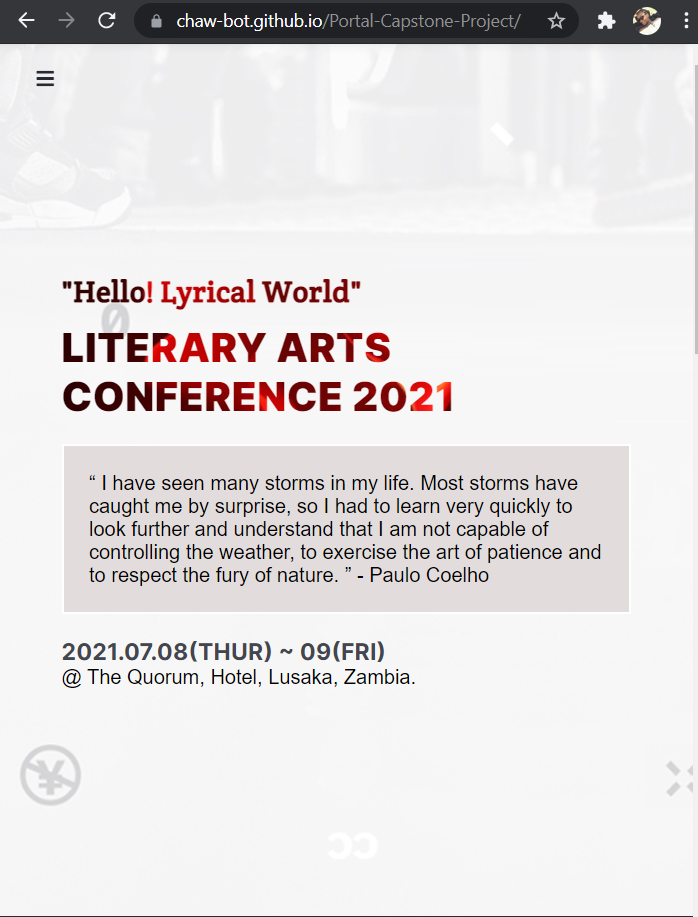
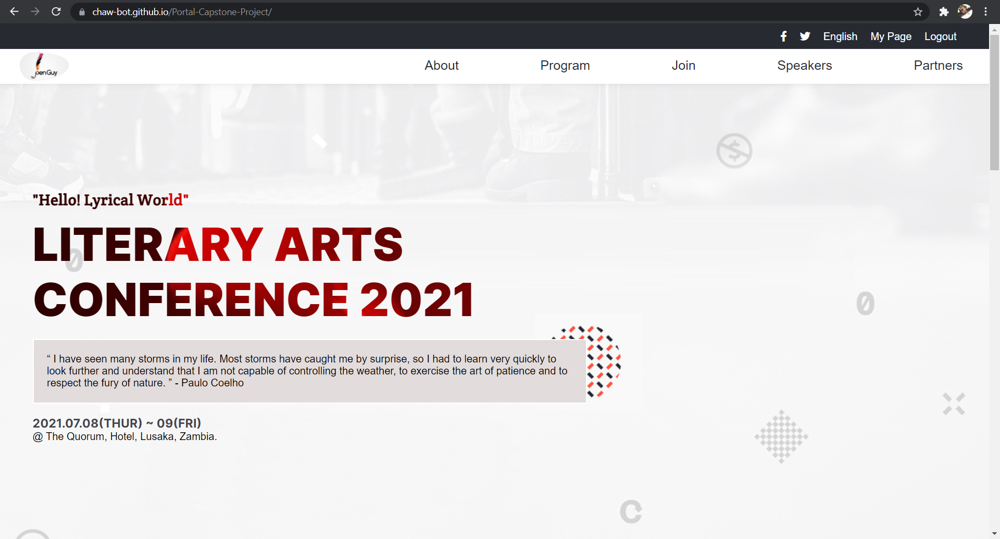

# Conference

> This is a conference page for a literary art conference to be held on 08th july 2021.

I have attached the link to the [Loom Video](https://www.loom.com/share/478d2b9c4f91495da5956eec25943c07) showing how the video works.

You can [click here](https://chaw-bot.github.io/Portal-Capstone-Project/) to veiw the live version of the conference page. 

Below, I have attached screenshots of the: 

Mobile Version.

Desktop Version

In this project I built the page using a variety of CSS properties such us,
Flex-box, Grid, media queries, animations and transitions. I have used DOM manipulation as well.

To this project I have added :
- Navigation bar
- A speakers area which is built dynamically with JS
- Two HTML files

## Built With

- HTML
- CSS
- JavaScript

## Getting started
To get a local copy up and running follow these simple example steps.

### Prerequisites
- Gitbash installed to navigate between the branches.
- A preferred text editor for example VS Code.

### Install
Clone this [GitHub Repo](https://github.com/chaw-bot/Portal-Capstone-Project/) to your computer on yourFolder by typing these commands in the terminal or download as a Zip file and extract.

$ mkdir yourFolder

$ cd yourFolder

$ git clone https://github.com/chaw-bot/Portal-Capstone-Project/

## Authors

👤 **Author**

- GitHub: [@chaw-bot](https://github.com/chaw-bot)
- Twitter: [@chaw36422087](https://twitter.com/chaw36422087)
- LinkedIn[Chawanzi Ng'uni](https://www.linkedin.com/in/chawanzi-ng-uni-449328212/)

## 👏 Acknowledgement 🥇
This page design was an inspiration from the original design idea by [Cindy Shin in Behance](https://www.behance.net/adagio07).

## 🤝 Contributing

Contributions, issues, and feature requests are welcome!

Feel free to check the [issues page](https://github.com/chaw-bot/Portal-Capstone-Project/issues/).

## Show your support

Give a ⭐️ if you like this project!

## 📝 License

This project is [MIT](./MIT.md) licensed.
